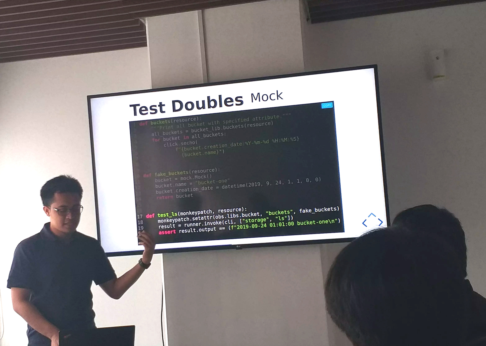

  

Hi, I'm Azzam S.A. 

I love solving hard things to make people live happily.

- ❤️ I love to [building things](https://azzamsa.com/projects/#created) in Rust, Python and Typescript.
- 🍴 I contributed to [various projects](https://azzamsa.com/projects/#contributed).
- 📬 Reach me via [Email or Twitter](https://azzamsa.com/contact)
- 🍰 Find out more about me at [azzamsa.com](https://azzamsa.com/)

---

